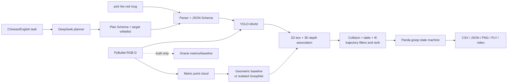

# Open-Vocabulary Perception-Guided Robotic Grasping

A reproducible text-to-grasp research project in PyBullet. A user can enter
`pick the mug`; the system validates the instruction, runs YOLO-World with a
dynamic text class, reconstructs a metric RGB-D point cloud, associates the 2D
semantic result with scene-level 6-DoF candidates, filters collisions and Panda
IK trajectories, and executes pregrasp, approach, close and lift states.

The current machine has verified both the CPU baseline and **official GraspNet
GPU inference** on its RTX 3050 through a dedicated CUDA 11.7 Conda service.
The complete real-YOLO + official-GraspNet bottle run reaches `DONE`. After
contact-volume scoring, lift-IK filtering and consistent mug geometry were
added, a real-YOLO + official-GraspNet mug run also reached `DONE`. The current
four-class, 40-episode fixed-seed evaluation reaches **26/40 (65%)** end to end,
with 95% detection success and 87.5% IK reachability. Exact evidence is in
[PROGRESS.md](PROGRESS.md).

The optional terminal Agent adds a DeepSeek high-level planner for Chinese or
English commands. Its output is JSON-Schema validated and dispatched only to the
existing grasp pipeline; it cannot execute arbitrary Python or shell commands.
The fully combined path—real `deepseek-v4-flash`, real YOLO-World, the official
GraspNet checkpoint and Panda execution—was verified in one seed-0 bottle run on
2026-08-15. It reached `DONE` and lifted the bottle 0.117293 m without using
simulator truth for semantic selection.


## Architecture



The simulator instance mask is never a substitute for YOLO in the open-vocabulary
path. It is used only for explicitly named oracle experiments, post-selection
metrics, physics queries and success evaluation. See the full
[architecture](docs/architecture.md) and [coordinate conventions](docs/coordinate_frames.md).

## What is actually implemented

| Capability | Status |
| --- | --- |
| Randomized Panda tabletop scene, fixed RGB-D camera, RGB/depth/instance capture | CPU verified |
| OpenGL depth conversion, point cloud, projection and frame transforms | CPU verified and unit-tested |
| Deterministic command parser, JSON Schema and action whitelist | CPU verified |
| Terminal DeepSeek Agent, plan validation and audit logs | Real `deepseek-v4-flash` + official GraspNet E2E verified |
| YOLOv8s-World-v2 dynamic text detection and raw/overlay output | Real model, CPU verified |
| Scene-wide geometric candidate generation and semantic/depth association | CPU verified; not GraspNet |
| Table/cloud/workspace/width/approach/IK/trajectory filtering | CPU verified |
| Panda execution state machine and automatic lift/proximity success | CPU verified |
| Fixed-seed CSV/JSON/Markdown/video batch evaluation | 40-episode real GraspNet benchmark + CPU baselines |
| Official GraspNet service and PyBullet NPZ request/response contract | RTX 3050 / CUDA 11.7 verified |
| Semantic-free `graspnet-only` comparison | Executable; detection metrics reported as n/a |
| Real YOLO + official GraspNet + Panda execution | 40 episodes: 26/40 end-to-end success |
| Real RGB-D camera or physical arm | Not connected in this version |

## Environment and installation

Required: Linux, Python 3.10 or 3.11, about 5 GB of free space for the main
environment, and a graphical session only if live PyBullet GUI is desired. CPU
simulation, tests and YOLO inference do not require CUDA.

This project has its own Conda environment, `ovg`; it does not modify `base` or
the user's LeRobot environment:

```bash
cd /home/ubuntu/open-vocab-grasping
./scripts/bootstrap.sh
source /home/ubuntu/miniforge3/etc/profile.d/conda.sh
conda activate ovg
which python
python --version
```

For an existing environment, install the editable package with:

```bash
python -m pip install -e '.[dev,yolo,ui,agent]'
```

Run `python scripts/download_assets.py` to print the recorded YOLO asset and
checksum. The first `detect` call downloads the official weight if it is absent.
Downloaded weights, third-party source, environments and run outputs are ignored
by Git. Sources, pins, hashes and licenses are recorded in
[third_party_licenses.md](docs/third_party_licenses.md).

## Quick start

```bash
# Environment audit
python -m open_vocab_grasping.cli doctor

# Parse without moving a robot
python -m open_vocab_grasping.cli parse --instruction "pick the red mug"

# CPU oracle + geometric smoke baseline
python -m open_vocab_grasping.cli smoke --config configs/cpu_smoke.yaml

# Capture RGB-D and point cloud
python -m open_vocab_grasping.cli capture --config configs/default.yaml

# Real open-vocabulary detector and 2D/3D association
python -m open_vocab_grasping.cli detect --target "mug" --seed 0 --config configs/default.yaml
python -m open_vocab_grasping.cli associate --target "mug" --seed 0 --config configs/default.yaml

# Complete real-YOLO + geometric-baseline grasp
python -m open_vocab_grasping.cli run --instruction "pick the mug" --seed 0 --config configs/default.yaml

# Regression tests
PYTEST_DISABLE_PLUGIN_AUTOLOAD=1 pytest -q
```

`run --target mug` is equivalent to the validated English instruction. No LLM or
external API is required, and no model output is evaluated as Python code.

## DeepSeek terminal Agent

Configure the key only in the current shell; never paste it into YAML, source
code or a run artifact:

```bash
read -s -p "DeepSeek API Key: " DEEPSEEK_API_KEY; echo
export DEEPSEEK_API_KEY
python -c 'import os; print("set" if os.getenv("DEEPSEEK_API_KEY") else "missing")'
```

Start an interactive session and enter a Chinese or English task at `ovg>`:

```bash
bash scripts/run_agent.sh
```

```text
ovg> 请帮我抓取桌面上的杯子
```

To watch the Panda move live, use the GUI terminal entry instead:

```bash
bash scripts/run_agent_gui.sh
```

After the DeepSeek plan passes validation, a separate PyBullet 3D window opens
from VS Code and runs the motion with real-time pacing. The final state remains
visible for 10 seconds, then the terminal prints a clickable `demo.mp4` path and
returns to `ovg>`. This requires a graphical desktop and a valid `DISPLAY`.

For the verified official GraspNet backend, use the bottle configuration:

```bash
python -m open_vocab_grasping.cli agent --mode deepseek \
  --instruction '请帮我抓取桌面上的瓶子' --seed 0 \
  --config configs/agent_graspnet.yaml
```

Or select `OVG: DeepSeek + 官方 GraspNet + 实时窗口` under VS Code Run and
Debug after exporting `DEEPSEEK_API_KEY` in the VS Code terminal. The no-cost
integration check at `outputs/20260814_155614_596265_run_seed0/` used a clearly
labelled Mock planner but real YOLO, official GraspNet and Panda execution; it
lifted the bottle 0.118767 m and recorded `open-vocab-graspnet` consistently.

Verified fully combined real-API example (2026-08-15): the instruction
`请帮我抓取桌面上的瓶子` produced an `open-vocab-graspnet` plan through
`deepseek-v4-flash` in 1.358 s (310 tokens). Real YOLO-World selected the bottle
at IoU 0.913144, the official checkpoint emitted 1,005 candidates, five survived
semantic/geometric/collision/IK filtering, and Panda lifted the bottle 0.117293 m.
The complete run reached `DONE`; simulator truth was not used for semantic
selection. See the [audited result](outputs/20260815_131627_786978_run_seed0/agent_result.json),
[generated allowlisted plan](outputs/20260815_131627_786978_run_seed0/agent_generated_plan.py)
and [execution video](outputs/20260815_131627_786978_run_seed0/demo.mp4).

Useful commands are `/help`, `/status`, `/seed 3`, `/mode deepseek`,
`/mode mock`, `/mode deterministic`, `/last` and `/quit`. For one reproducible
non-interactive real-API run:

```bash
bash scripts/run_agent.sh --mode deepseek \
  --instruction '请帮我抓取桌面上的杯子' --seed 0
```

The offline path is explicitly labelled and must never be reported as a real
DeepSeek result:

```bash
bash scripts/run_agent.sh --mode mock \
  --instruction '请帮我抓取桌面上的杯子' --seed 0
```

Every dispatched run adds `agent_request.json`, `agent_response.json`,
`agent_plan.json`, `agent_generated_plan.py`,
`agent_generated_plan_trace.json` and `agent_result.json` to the normal run
directory. The Python file is compiled from the already validated JSON plan,
then AST-checked to allow only the canonical six `controller` calls and executed
with no builtins against `SafeRobotController`. Each call is a one-shot gate for
the corresponding real pipeline stage and blocks until that stage completes;
missing, reordered or target-changing calls fail closed. Raw model-written
Python is never executed. The terminal prints the generated `.py` path after
every dispatched run.
Authorization headers and API keys never enter these files. See
[Agent architecture and safety](docs/agent_architecture.md).

Earlier CPU-geometric real-API example (2026-08-14): the Chinese instruction
`请帮我抓取桌面上的杯子` produced a schema-valid `mug` plan through
`deepseek-v4-flash` in 0.965 s (304 tokens), then the real YOLO/geometric
pipeline retained four of 16 candidates and reached `DONE`. The mug lifted
0.108188 m. See the [validated Agent result](outputs/20260814_122735_073119_run_seed0/agent_result.json)
and [execution video](outputs/20260814_122735_073119_run_seed0/demo.mp4).

### Agent reliability evaluation

The fixed suite in `configs/agent_instruction_suite.yaml` contains 20 Chinese
and English paraphrases: five each for mug, bottle, bowl and box. Planner-only
evaluation measures schema validity, target accuracy, generated-Python validity,
latency and tokens without starting PyBullet:

```bash
bash scripts/run_agent_evaluation.sh --mode deepseek --robot-cases-per-target 0
```

To additionally execute the first valid instruction for each target through
real YOLO-World, official GraspNet and Panda, run:

```bash
bash scripts/run_agent_evaluation.sh --mode deepseek \
  --robot-cases-per-target 1 --seed-start 0
```

The second command still sends all 20 planner requests but starts only four
robot episodes. It produces `cases.csv`, `summary.json`, `summary.md` and one
sanitized JSON audit per instruction. Planner-only accuracy and robot success
are reported separately, and failures remain in their denominators. Hosted API
usage may incur the provider's normal token charge.

Infrastructure validation on 2026-08-16 used the explicitly labelled Mock
planner: 18/20 plans passed because its small hand-written alias table does not
understand “方块” or “纸盒”; four CPU geometric robot episodes then achieved 3/4.
These numbers verify the evaluator and are not DeepSeek or GraspNet results.

## Interactive visual dashboard

Start the local control room from the project terminal:

```bash
conda activate ovg
bash scripts/run_dashboard.sh
```

Then open <http://127.0.0.1:7860>. The page accepts a validated instruction such
as `pick the mug` and offers four whitelisted actions: RGB-D capture, real
YOLO-World detection, 2D/3D association, and complete grasp execution. It shows:

- simulated RGB and detector/association overlays;
- an interactive, rotatable PLY point cloud;
- every candidate's score, pose, acceptance and rejection reasons;
- the execution-state timeline, structured metrics and generated MP4;
- the exact output directory and whether simulator truth entered selection.

The dashboard calls the same functions as the CLI and does not synthesize UI-only
results. It binds to `127.0.0.1`, sets `share=false`, serializes robot runs, and
never accepts arbitrary Python. Use `--port 7861` if 7860 is already occupied.

## CLI reference

| Command | Important arguments | Output |
| --- | --- | --- |
| `doctor` | none | OS, Python, packages, compiler and CUDA visibility |
| `parse` | `--instruction` | schema-validated action JSON |
| `smoke` | `--config`, optional `--target/--seed` | oracle/geometric CPU episode |
| `capture` | `--config`, optional `--seed` | RGB, depth, segmentation, camera, PLY |
| `detect` | `--target --config`, optional `--seed` | boxes, confidence, raw JSON, overlay |
| `export-graspnet` | `--config`, optional `--seed` | schema-v1.0 RGB-D NPZ request |
| `associate` | `--target --config`, optional `--seed` | candidate decisions and 2D/3D plots |
| `run` | one of `--target/--instruction`, `--config`, optional `--seed` | result, traces and GIF/MP4 |
| `evaluate` | `--targets --episodes --config`, optional `--modes` | batch CSV, summary and failures |
| `dashboard` | optional `--config/--host/--port/--in-browser` | local interactive control room |
| `agent` | optional `--instruction/--mode/--seed/--config` | one-shot or interactive validated task planner |

Configuration inheritance and all thresholds/score weights are in
[`configs/`](configs). `--episodes N` means N episodes for every target in every
enabled mode; three targets, two modes and `N=3` therefore execute 18 episodes.

## VS Code and visualizations

Open this folder in VS Code and select the dedicated interpreter
`/home/ubuntu/miniforge3/envs/ovg/bin/python`. Under **Run and Debug**
(`Ctrl+Shift+D`), the committed [launch configurations](.vscode/launch.json)
provide:

- `OVG: Agent + PyBullet 实时窗口 (Mock)` for a no-cost debugger launch that
  opens the same live simulator while clearly labelling the planner as Mock;
- `OVG: 交互式 Web 控制台` for text commands, images, point cloud, candidates,
  state timeline, metrics and videos in a browser;
- `OVG: PyBullet GUI 抓取演示` for the live Panda/table/object window;
- `OVG: YOLO + 三维关联` for detector and candidate overlays;
- `OVG: 全部 CPU 测试` for the regression suite.
- `OVG: 官方 GraspNet 瓶子实时抓取` for the verified GPU backend without an LLM;
- `OVG: DeepSeek + 官方 GraspNet + 实时窗口` for the full API-planned demo.

The equivalent graphical desktop command is `bash scripts/run_gui_demo.sh`.
PyBullet GUI requires a valid `DISPLAY`; a remote/headless session should keep
`simulation.gui: false` and inspect PNG, PLY, GIF and MP4 files in `outputs/`.
Useful verified artifacts include:

- [real YOLO detection](outputs/20260812_142139_666676_detect_seed0/detections.png)
- [2D semantic/geometric association](outputs/20260812_235957_378687_associate_seed0/association_2d.png)
- [3D top-down association](outputs/20260812_235957_378687_associate_seed0/association_3d_topdown.png)
- [end-to-end structured result](outputs/20260813_113306_340633_run_seed0/result.json)
- [H.264 demonstration video](outputs/20260813_113306_340633_run_seed0/demo.mp4)

## GraspNet GPU path

The official repository's legacy custom operators are isolated from the main
environment. The verified RTX 3050 compatibility environment uses official
PyTorch 1.13.1, CUDA 11.7 and locally compiled PointNet2/KNN operators:

```bash
bash services/graspnet/bootstrap-cu117.sh
bash services/graspnet/build-extensions-cu117.sh
conda run -n ovg-graspnet-cu117 \
  python services/graspnet/validate_extensions.py
```

Run the integrated path from the main environment:

```bash
conda run -n ovg python -m open_vocab_grasping.cli run \
  --target bottle --seed 0 --config configs/graspnet.yaml
```

The verified official example emitted 317 candidates (109 collision-free); a
saved PyBullet request emitted 362 (44 collision-free). The full seed-0 bottle
path generated 1,003 candidates, passed one through semantic/collision/IK filters
and lifted the target 0.117675 m. Exact commands and schema are in
[services/graspnet/README.md](services/graspnet/README.md) and
[schema.md](services/graspnet/schema.md).

## Evaluation protocol and actual results

The verified batch command was:

```bash
python -m open_vocab_grasping.cli evaluate \
  --targets "mug,bottle,bowl" --episodes 3 --config configs/evaluation.yaml
```

It ran 18 fixed-seed CPU episodes (three targets × three seeds × two modes):

| Mode | Episodes | Detection | IK reachable | End-to-end |
| --- | ---: | ---: | ---: | ---: |
| `oracle-perception` + geometric | 9 | 100.0% | 66.7% | 55.6% (5/9) |
| `open-vocab-simple` | 9 | 33.3% | 33.3% | 33.3% (3/9) |

The three real-YOLO mug episodes succeeded. The six bottle/bowl episodes failed
at real detection on the current procedural assets. Oracle bowls exposed table
penetration and one oracle mug did not lift. These failures remain in the
denominator; no GraspNet score was invented.

After enabling the official GPU backend and prompt ensembles, a second actual
evaluation ran 20 `open-vocab-graspnet` episodes:

| Target | Episodes | Detection | IK reachable | End-to-end |
| --- | ---: | ---: | ---: | ---: |
| bottle | 10 | 70.0% | 60.0% | **60.0% (6/10)** |
| mug | 10 | 100.0% | 70.0% | **0.0% (0/10)** |
| overall | 20 | 85.0% | 65.0% | **30.0% (6/20)** |

Mean official GraspNet inference was 6.002 s. Failures were three detector
misses, four no-accepted-candidate episodes and seven mug contact failures.
The source [episodes.csv](outputs/20260814_154643_981832_evaluation/episodes.csv)
and [GPU summary](outputs/20260814_154643_981832_evaluation/summary.md) contain
all runs; see the updated [failure analysis](docs/failure_analysis.md).

- [episodes.csv](outputs/20260813_115220_286118_evaluation/episodes.csv)
- [summary.json](outputs/20260813_115220_286118_evaluation/summary.json)
- [summary.md](outputs/20260813_115220_286118_evaluation/summary.md)
- [failure analysis](docs/failure_analysis.md)
- [experiment protocol](docs/experiment_protocol.md)

That 20-episode table is retained as the pre-improvement baseline. After contact
scoring, target-center refinement, prompt consensus and small-object handling,
the current four-class benchmark was run with:

```bash
python -m open_vocab_grasping.cli evaluate \
  --targets mug,bottle,bowl,box --episodes 10 \
  --config configs/evaluation_open_vocab_graspnet.yaml
```

| Target | Episodes | Detection | Target selection | IK reachable | End-to-end |
| --- | ---: | ---: | ---: | ---: | ---: |
| mug | 10 | 10/10 | 10/10 | 10/10 | **6/10** |
| bottle | 10 | 9/10 | 9/10 | 9/10 | **9/10** |
| bowl | 10 | 10/10 | 9/10 | 9/10 | **5/10** |
| box | 10 | 9/10 | 9/10 | 7/10 | **6/10** |
| **overall** | **40** | **38/40 (95%)** | **37/40 (92.5%)** | **35/40 (87.5%)** | **26/40 (65%)** |

Mean official GraspNet inference was 5.845 s and mean total episode time was
11.519 s. All 14 failures remain in the denominator. See the current
[episodes.csv](outputs/20260815_001417_040250_evaluation/episodes.csv),
[summary](outputs/20260815_001417_040250_evaluation/summary.md), and
[failure analysis](docs/failure_analysis.md).

Coordinate accuracy and executable filter ablations have dedicated commands:

```bash
python -m open_vocab_grasping.cli geometry-eval \
  --episodes 10 --seed 200 --config configs/default.yaml

python -m open_vocab_grasping.cli ablate \
  --target mug --seed 0 --config configs/graspnet.yaml
```

The actual ten-episode geometry report passed all configured thresholds. The
seed-0 mug ablation retained five separately executed variants; it is an easy
scene where all five happened to lift the mug, while candidate counts still
showed that removing depth consistency increased association from 32 to 37.

## Coordinates

All distances are metres, rotations are right-handed, homogeneous vectors are
columns, and `T_destination_source` maps source coordinates into destination
coordinates. Camera coordinates follow OpenCV: x image-right, y image-down, z
forward. The implementation and tests contain no unexplained trial-and-error
axis swaps. See [coordinate_frames.md](docs/coordinate_frames.md).

## Known limitations

- The current benchmark still has two detector misses and three incorrect target
  selections across 40 episodes; low-score prompt consensus improves synthetic
  bowl/box detection but does not eliminate appearance sensitivity.
- CPU defaults deliberately use a top-down geometric baseline; select
  `configs/graspnet.yaml` for the official neural generator.
- Contact remains the main bottleneck: nine of the current 14 failures execute a
  trajectory but do not lift the object. Mug is 6/10 and bowl is 5/10, so the
  official RealSense/YCB checkpoint still has a measurable synthetic-domain gap.
- The physics mug uses detailed render geometry with a simplified collision
  proxy. Sim-to-real contact and material variation are not modeled.
- No real sensor, ROS stack or physical robot is connected.

## FAQ

**Why does no simulator window open during tests?**  Reproducible tests use
PyBullet `DIRECT` mode. Use the VS Code GUI launch or `scripts/run_gui_demo.sh`
from a graphical Ubuntu session.

**Why not use the computer's base Conda environment?**  `ovg` is a project-only
Python 3.10 environment. It prevents PyBullet/YOLO pins from colliding with base
or LeRobot. GraspNet has a second environment because its CUDA stack is much older.

**Does a host GPU guarantee CUDA works here?**  No. A container or managed
runtime also needs `/dev/nvidia*`, a compatible driver, CUDA libraries and the
toolkit required to compile extensions. `doctor` reports the process-visible
state; see [troubleshooting](docs/troubleshooting.md) for alternatives.

**Can I use oracle perception for the final method?**  No. It is only a named
debug/upper-bound mode. Open-vocabulary reports use real detector output and
preserve zero-detection episodes as failures.

## Portfolio and real-robot follow-up

- [Chinese resume and English CV descriptions](docs/portfolio.md)
- [Implementation-based interview questions](docs/interview_questions.md)
- [Real RGB-D and SO-ARM101 migration plan](docs/real_robot_migration.md)
- [Troubleshooting guide](docs/troubleshooting.md)

For commercial reuse, review every upstream license—especially Ultralytics and
the GraspNet research-only terms—rather than assuming research-code permissions
cover deployment.
