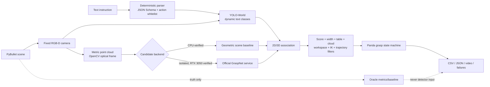

# System architecture



## Runtime boundaries

The `ovg` Conda environment owns PyBullet, Open3D, YOLO-World, geometry,
planning, execution and evaluation. The legacy official GraspNet code lives in
the separate `ovg-graspnet-cu117` environment and communicates through a versioned
NPZ request/response schema. A GraspNet failure therefore cannot corrupt the
main environment or silently turn into a different method.

| Layer | Main implementation | Contract |
| --- | --- | --- |
| Language | `nlp.py` | `{action, target, destination}` validated before dispatch |
| Simulation | `simulation/` | RGB, metric depth, segmentation truth, `K`, poses |
| Perception | `perception/` | detections and coloured workspace point cloud |
| Candidates | `grasping/interface.py` | center, rotation, width, depth, score, collision |
| Association | `grasping/association.py` | projected pixel, depth delta, accept/reject reason |
| Planning | `planning/` | IK, collisions, interpolated trajectories, state machine |
| Evaluation | `evaluation/` | one flat row per episode plus aggregate reports |

## Semantic-selection boundary

The open-vocabulary path receives only RGB-D, camera calibration and the text
prompt before grasp selection. PyBullet body IDs are allowed only for:

- oracle-perception experiments whose mode name explicitly says `oracle`;
- post-selection target/detection metrics;
- physics collision queries and the final lift/proximity success test.

The stage-4/5 CPU path removes the table height band, clusters the entire scene
cloud, generates top-down candidates for every cluster, projects each center,
and then keeps candidates satisfying the real YOLO box and depth consistency.
Thus the candidate generator is scene-wide rather than secretly cropped with a
truth object mask.

## Candidate filter order

```text
associated candidates
  -> official GraspNet collision (GPU mode)
  -> grasp score / predicted width / workspace / table clearance / approach direction
  -> RGB-D target center inside the finite gripper-height slice
  -> non-target point-cloud clearance
  -> pregrasp IK + grasp IK
  -> home-to-pregrasp collision interpolation
  -> pregrasp-to-grasp collision interpolation
  -> configured joint-score ranking
  -> Panda execution and lift-based success evaluation
```

Every candidate retains rejection reasons. The joint score weights live in YAML,
not inside the ranking code.

## Implemented experiment modes

| Mode | Perception | Candidate source | Current status |
| --- | --- | --- | --- |
| `oracle-perception` | simulator instance truth | geometric baseline | CPU verified |
| `open-vocab-simple` | real YOLO-World | geometric scene baseline | CPU verified |
| `graspnet-only` | no text selection | official GraspNet | GPU verified; executable baseline |
| `open-vocab-graspnet` | real YOLO-World | official GraspNet | GPU verified; 26/40 four-class E2E |

The current 40-episode GPU report records every detection/planning/contact
failure. A one-episode `graspnet-only` validation selected a grasp without
text, missed the requested bottle and recorded the failure rather than assigning
semantic credit.
